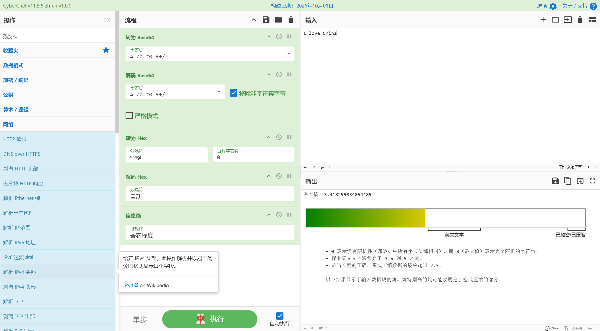

# CyberChef 中文汉化版

[中文](#中文版) | [English](#english)



## 中文版

CyberChef 中文版是社区维护的非官方简体中文版本，基于 [gchq/CyberChef](https://github.com/gchq/CyberChef)。项目保留了 CyberChef 的核心功能和执行流程，并将界面、操作名称、操作说明、参数提示和错误信息翻译为简体中文。

除 HTTP 请求、DNS over HTTPS 等需要主动访问网络的操作外，数据均在浏览器本地处理，不会上传到本项目服务器，适合离线环境使用。

### 下载与使用

在线使用：[GitHub Pages](https://anyawantsstars.github.io/CyberChef_zh-cn/)

前往 [Releases](https://github.com/AnyaWantsStars/CyberChef_zh-cn/releases) 下载最新的离线包，解压后直接打开 `html`。

如果需要自行构建：

```bash
git clone https://github.com/AnyaWantsStars/CyberChef_zh-cn.git
cd CyberChef_zh-cn
npm install
npm run build
```

构建结果位于 `build/prod`。该目录可直接部署，ZIP 离线包内含单文件版本和全部资源。

### 版本说明

- 当前项目版本：`11.5.5`
- 对应上游：官方 `11.5.0` 及后续提交
- 社区汉化版本：`v1.0.0`
- 构建文件：`CyberChef_v11.5.5_zh-cn_v1.0.0.zip`

汉化版版本号与官方版本号分开维护，相关窗口会分别显示两个版本。

### 功能特性

- 覆盖主要界面、操作名称、参数和错误提示的简体中文翻译
- 核心算法和执行流程沿用官方实现
- 支持拖放排序、自动执行、Magic 自动检测、断点调试和流程分享
- 流程和数据只保存在本地，可下载后离线使用
- 保留 Node.js API 入口，可直接在 Node.js 中调用操作
- 支持中英文流程（recipe）双向转换，并兼容官方英文参数和返回文本

### 开发与构建

需要 Node.js 24 或 26。推荐使用 Node.js 24，项目也提供了 [.nvmrc](./.nvmrc)。

| 命令               | 说明                                  |
| ---------------- | ----------------------------------- |
| `npm start`      | 启动开发服务器，地址为 `http://localhost:8080` |
| `npm run build`  | 生成生产版本到 `build/prod`                |
| `npm test`       | 运行 Node.js 和操作测试                    |
| `npm run testui` | 运行浏览器 UI 测试，需先完成生产构建                |
| `npm run lint`   | 检查代码规范                              |
| `npm run node`   | 生成 Node.js 包                        |
| `npm run repl`   | 启动 Node.js 交互环境                     |

### 汉化约定

- 只翻译用户可见的文案，包括操作名称、说明、参数名称、帮助信息和错误信息。
- 保留算法及协议缩写，例如 `Hex`、`AES`、`XOR`、`Base64`、`SHA`、`ADD`、`OR`、`Binary` 和 `Auto`。完整单词可根据上下文翻译，例如 `Decimal` 译为“十进制”。
- 不翻译对象键、选项值、内部比较串和影响执行逻辑的标识符。`argSelector` 的 `name` 可以汉化，但对应的 `value` 必须保持原样。
- 统一将`Bake` 汉化为“执行”、统一将 `Recipe` 汉化为“流程”。

### 维护说明

- CodeMirror 的查找和替换面板文案来自 `@codemirror/search`。项目通过 `postinstall` 执行 `patch-codemirror-zh.cjs` 应用中文补丁，更新该依赖后需要重新验证。
- 源码统一使用 UTF-8 和 LF 换行。不要提交 CRLF 文件，否则 lint 和构建可能失败。
- 合并上游更新后，需要检查 `Gruntfile.js` 中的 Windows 构建兼容补丁、版本注入逻辑和汉化文本是否仍然有效。
- 中英文流程（recipe）和 Node.js API 兼容逻辑位于 `src/core/zh-cn/`，修改映射后需要运行 Node.js 和 operation 测试。
- Windows 构建链保留了 `webpack.config.js` 的双分隔符 Babel exclude 规则，避免 `node_modules` 被误交给 Babel 处理。
- `.fnt` 和 `bmfonts` 下的 `.png` 必须继续由资源规则处理，否则会被误当作 JavaScript 模块。
- 上游依赖或 webpack 配置变化后，应重新执行全新 `npm ci` 和生产构建；若再次出现 `core-js-pure` 相关的 `$ is not a function`，需要检查依赖版本和 Babel 范围。

### 已知限制

- 少量可见文本可能仍为英文。
- 不同浏览器和超大数据场景仍需要实际使用验证。部分问题可能来自官方版本。
- 这是源码级汉化，不使用运行时 i18n 框架。上游更新涉及相同字符串时，需要在合并过程中人工确认。

### 问题反馈

汉化缺失、术语问题、英文流程（recipe）兼容和 Node.js API 问题，请提交到本仓库 [Issues](https://github.com/AnyaWantsStars/CyberChef_zh-cn/issues)。

官方算法、协议或 operation 问题，请优先提交到 [gchq/CyberChef](https://github.com/gchq/CyberChef/issues)。

提交问题时请尽量提供：

- 汉化版本和对应官方版本
- 操作名称或完整的流程（recipe）
- 输入数据、复现步骤和实际结果
- 必要的截图或错误信息

欢迎提交汉化修正 PR。改动请尽量限定在翻译文本范围内，并说明修改原因。

### 变更记录

- 汉化版变化：[CHANGELOG.zh-cn.md](./CHANGELOG.zh-cn.md)
- 官方变化：[CHANGELOG.md](./CHANGELOG.md)

### 安全

安全问题请按照 [SECURITY.md](./SECURITY.md) 中的方式报告。

### 许可证

本项目基于官方 CyberChef 派生，遵循 [Apache 2.0 License](https://www.apache.org/licenses/LICENSE-2.0)，并受 Crown Copyright 约束。

来源和修改说明见 [NOTICE](./NOTICE)。

### 发布形式

本项目提供 GitHub Pages 在线版本和 ZIP 离线包，不提供 Docker 镜像或 Docker 部署支持。

### 项目历史

这个项目最早尝试直接汉化源码，但构建环境折腾了很久仍未编译成功，于是先改为基于官方发行版进行规则驱动的查找替换。第一次集中开发从 4 月开始，中间暂停后于 7 月继续，经过多次失败和反复迭代，在 8 月初形成初版，并陆续适配了 v11.2.0、v11.3.0 和 v11.4.0。

v11.5.0 发布后，原有规则大量失效，需要重新适配。项目评估过运行时 i18n，但由于官方源码没有预留接口，提取、同步和测试成本都很高，最终改为直接修改源码。源码汉化完成后又出现了流程（recipe）和 URL 与官方不兼容的问题，全面改写内部逻辑的成本过高，因此在解析和导入导出边界增加兼容层，使中英文流程（recipe）可以互相转换。

汉化的核心工作使用 AI 和 Agent 工具经过上百轮对话完成，但除此之外的很多工作如方案制定、方向选择以及改动程度等仍需要人工判断。这个项目不是“AI 加一句话”就能直接完成的小工作。

### 相关项目与技术路线

以下项目采用过不同的汉化路线，列在这里作为参考，不代表排名：

- [SRK-Toolbox](https://github.com/Raka-loah/SRK-Toolbox)，同时提供 [在线版](https://btsrk.me/) 和 [镜像站点](https://raka.rocks/)
- [CodeSecurityTeam/CyberChef-ZH](https://github.com/CodeSecurityTeam/CyberChef-ZH)
- [DayDayDayDreaming/CyberChef_ZH_CN](https://github.com/DayDayDayDreaming/CyberChef_ZH_CN)
- [imbyter/CyberChef_CN](https://github.com/imbyter/CyberChef_CN)
- [cyberchef.cn](https://cyberchef.cn/)，提供中文文档和使用入口

常见路线包括：只翻译界面外壳、深度翻译并改名套壳、运行时替换 DOM 文本，以及在源码中直接汉化。CyberChef 早期没有 i18n 设计，operation 名称和参数值经常直接参与内部判断，因此汉化越深，维护和兼容成本越高。

本项目采用源码级汉化，并额外维护流程（recipe）中英文兼容层，目标是在保留官方流程互通能力的同时提供完整中文体验。感谢上述项目以及所有 CyberChef 汉化参与者长期积累的经验。

## English

CyberChef zh-cn is an unofficial, community-maintained Simplified Chinese build of [CyberChef](https://github.com/gchq/CyberChef). Processing is client-side by default, and user-facing strings are localized directly in the source code.

Try the online version at [GitHub Pages](https://anyawantsstars.github.io/CyberChef_zh-cn/).

### What This Version Provides

- Simplified Chinese translations for the main interface, operation names, descriptions, arguments, and errors
- The standard CyberChef workflow, including drag-and-drop recipes, Magic detection, breakpoints, URL sharing, and offline use
- A Node.js API for invoking operations from scripts
- Bidirectional Chinese and English recipe compatibility, including official argument and result formats
- No runtime i18n layer and no external translation service

Operations such as HTTP Request and DNS over HTTPS will contact the endpoints you configure. This project does not operate a translation or data service.

### Build

Use Node.js 24 or 26, then run:

```bash
npm install
npm start
```

Run `npm run build` to create a production build in `build/prod`. The ZIP package contains a standalone HTML file and all required assets.

This fork publishes the GitHub Pages site and the offline ZIP package. It does not provide a Docker image or Docker deployment support.

Windows builds retain additional compatibility rules for Babel's `node_modules` exclusion and `.fnt`/`bmfonts` assets. Re-run a clean `npm ci` and production build after merging upstream dependency or webpack changes.

Other available commands:

| Command          | Purpose                                       |
| ---------------- | --------------------------------------------- |
| `npm test`       | Run Node.js and operation tests               |
| `npm run testui` | Run browser UI tests after a production build |
| `npm run lint`   | Run code linting                              |
| `npm run node`   | Build the Node.js package                     |
| `npm run repl`   | Start the Node.js REPL                        |

### Architecture

The public `main` branch contains this localized build. Upstream English source is tracked from `gchq/CyberChef`, while translations and compatibility handling are maintained in this repository. Upstream changes are merged and reviewed for conflicts.

The compatibility layer under `src/core/zh-cn/` converts Chinese and English recipes and preserves the official Node.js API shape. It is not a general runtime i18n framework.

### Localization Changes

Translate user-visible text only. Keep algorithm names, protocol abbreviations, object keys, option values, and internal comparison strings unchanged. See the Chinese section above for the full terminology and testing conventions.

The `postinstall` command applies a patch from `patch-codemirror-zh.cjs` to localize the CodeMirror search panel. Keep source files UTF-8 encoded with LF line endings.

### Why Not Runtime i18n

CyberChef does not expose a general i18n boundary. Operation names and option values are often compared directly in source code, and some messages are assembled dynamically. A runtime framework or extracted key table would need to be kept synchronized with every upstream release and would still require handling source-level logic that is not designed for translation.

This project therefore uses direct source localization plus a small compatibility layer for recipes and the Node.js API. It avoids introducing a parallel language runtime that would be expensive to maintain.

### Other Languages

Because translated strings live next to the upstream source and bilingual recipes use explicit compatibility maps, this branch can serve as a reference for other language versions. Contributors can compare this build with upstream, locate translated regions and intentionally preserved technical tokens, then replace the Chinese text for their target language. Translating the marked regions is a useful contribution even without adopting a runtime i18n framework.

### Compatibility

Chinese and English recipes can be imported and exported. The Node.js API accepts official English argument names and values, and returns the official property names. A small amount of visible text may remain in English, and browser or large-file behavior should still be verified in real use.

### Contributing

Localization and fork-specific compatibility issues belong in this repository. Algorithm, protocol, and official operation issues should be reported to [gchq/CyberChef](https://github.com/gchq/CyberChef/issues). See [CONTRIBUTING.md](./CONTRIBUTING.md) for the contribution and licence rules.

### Changelog

- zh-cn changes: [CHANGELOG.zh-cn.md](./CHANGELOG.zh-cn.md)
- Upstream changes: [CHANGELOG.md](./CHANGELOG.md)

### License

This project is derived from CyberChef and is distributed under the [Apache 2.0 License](https://www.apache.org/licenses/LICENSE-2.0), subject to Crown Copyright. See [NOTICE](./NOTICE) for provenance and modification details.
